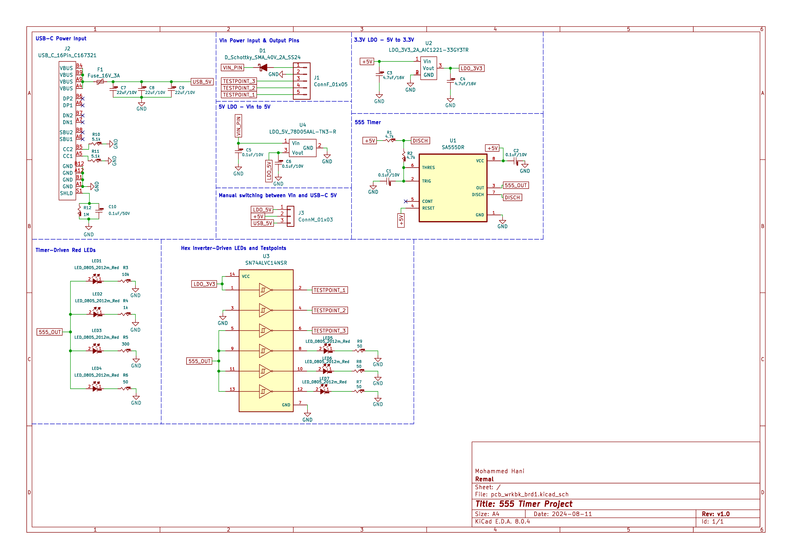
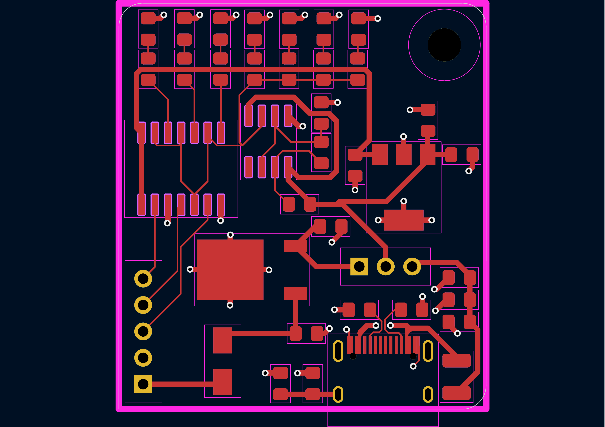

# 555 Timer Board Project

## Project Overview

This project is a KiCad-designed circuit board centered around the 555 timer IC, which serves as a versatile timer and oscillator. The board is powered by a 5V power supply and can be fed through either a USB C connector or a voltage source connected to the Vin pin. The design allows for manual switching between these two power inputs.

## Features

- **Power Supply**:
  - Input voltage: 5V.
  - Power input via USB C connector or Vin pin.
  - Manual switch to select between USB C and Vin pin for power source.

- **555 Timer**:
  - Operates at approximately 50% duty cycle.
  - Generates a 1 kHz frequency.
  - Drives 4 LEDs with varying brightness.

- **Hex Inverter IC**:
  - Connected to the 555 timer output.
  - Drives 3 additional LEDs using the inverted output from the 555 timer.

- **Test Points**:
  - **Testpoint 1**: Connected to the inverted 3.3V output.
  - **Testpoint 2**: Connected to the inverted ground.
  - **Testpoint 3**: Connected to the inverted 555 timer output.
  - A voltmeter can be connected to these test points to measure the voltage levels.

## Schematic and PCB Design

## Usage

To use the board:
1. **Power Connection**:
   - Choose between powering the board via USB C or the Vin pin.
   - Use the onboard pins to select the desired power source.
   
2. **LED Display**:
   - Observe the 4 LEDs driven by the 555 timer. The brightness of each LED varies according to the connected resistance.
   - The 3 LEDs connected to the hex inverter IC display the inverted 555 timer output.

3. **Testing**:
   - Use a voltmeter to measure the voltage at the designated test points (Testpoint 1, Testpoint 2, and Testpoint 3) for further analysis.
